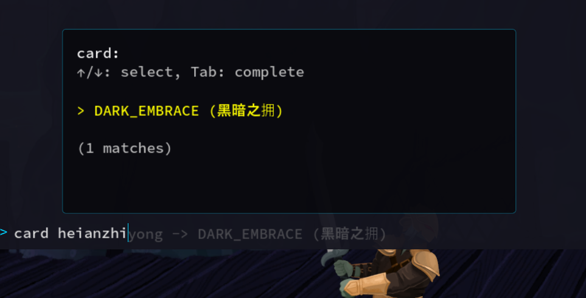
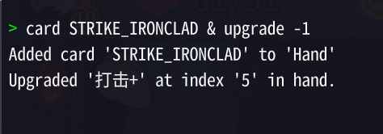

## 更好的控制台

> 一个杀戮尖塔2的控制台增强mod。

支持功能：

* 中文下可使用拼音进行内容补全候选提示。

> 中文是ritsulib的补充。

* 改善自动补全功能，现在自动进入并优化UI，方向键选择按tab补全即可。

* 可以使用`&&`（上一步不出错才执行下一步）以及`&`（无视上一步是否做错）进行多个命令同时输入。

* 把一些使用索引的做了负值保护。例如，输入-1改为可选的最后一个目标。